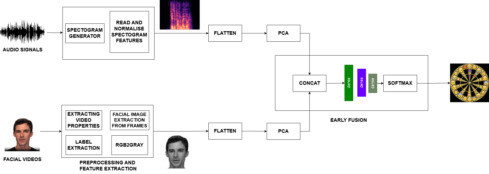
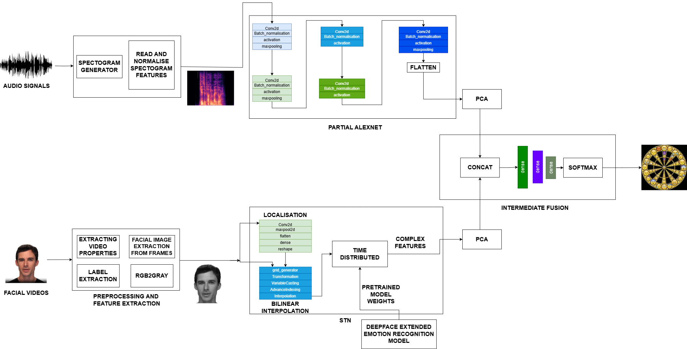
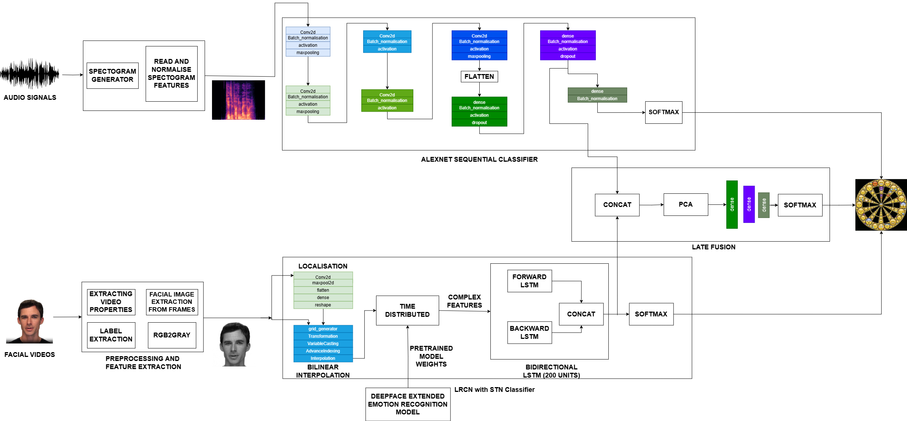

# Master's Thesis: Exploring Gender Bias in Multimodal Emotion Recognition - The Impact of Training Data Representation and Fusion Techniques
This repository contains the code and resources for the thesis on multimodal emotion recognition systems and the analysis of gender bias within these models. The project focuses on evaluating various fusion techniques, datasets, and fairness metrics to understand how gender bias manifests and impacts model performance in emotion recognition systems.

## Repository Structure

- **`/architecture`**: Contains the architecture of all unimodal and multimodal model used in this study.
- **`/data`**: Contains sample of datasets (RAVDESS and CREMA-D) used in the study as well as the csv files provided with the dataset or generated by us during the development.
- **`/notebooks`**: Includes implementations of the different unimodal and emotion recognition models used in the thesis, such as Audio, Video, Early Fusion, Intermediate Fusion, and Late Fusion models. Model architectures and training routines are provided. Details of implementation are included in the respective notebooks. For maximum and step by step visualization of the flow of experiment, analysis is performed in Jupyter Notebook.
- **`/scripts`**: Utility scripts for label extraction, and visualizing results.
- **`/fairness`**: Fairness metric results across each model and each type of data split (equal representation, male majority, female majority) for both datasets.
- **`/results`**: Contains plots based on the experimentation.

## Project Overview

This project explores gender bias in multimodal emotion recognition systems, specifically focusing on how different fusion techniques (early, intermediate, and late fusion) contribute to bias. The research investigates the impact of gender representation in training datasets on the observed biases and evaluates various fairness metrics to quantify these biases.

## Objectives

- To determine the extent to which gender representation in training datasets influences gender bias in emotion recognition systems. This is done by creating three types of training data, one with equal male and female representation, second with male majority (60%), and third with female majority (60%).
- To assess how different fusion techniques affect the level of gender bias in these systems.
- To evaluate the effectiveness of various fairness metrics in reporting gender bias.

## Datasets Used

- **RAVDESS**: A gender-balanced dataset with facial and vocal expressions, used to explore how emotions like calm, happy, sad, etc., are recognized.
- **CREMA-D**: A diverse dataset in terms of age, ethnicity, and emotion levels, providing a more realistic context for testing the robustness of emotion recognition systems.

## Architecture and Techniques

- **Audio and Video Models**: Individual models were trained on audio and video data separately using architectures like Long-term Recurrent Convolutional Networks (LRCN) and AlexNet proposed by Abdellatif et al.
- **Fusion Techniques**: The study employs three fusion techniques:
  - **Early Fusion**: Early fusion pipeline proposed in this study combines features from multiple modalities at the initial stages of processing.



  - **Intermediate Fusion**: Intermediate fusion pipeline proposed in this study Integrates partially processed features to create a unified representation.



  - **Late Fusion**: Late fusion pipeline inspired by Abdellatif et al. combines the outputs of fully processed unimodal data, followed by classification.



## Fairness Metrics

- **Demographic Parity**: Ensures that the model's predictions are independent of the sensitive attribute (e.g., gender).
- **Equalized Odds**: Focuses on ensuring consistent true positive and false positive rates across different demographic groups.

## Results Summary

- The study found that models trained on gender-balanced datasets generally exhibited lower bias.
- Late fusion models were most effective in minimizing bias, while early fusion showed some unexpected results, sometimes outperforming unimodal models despite the learning process being simpler compared to the unimodal models.
- The impact of fusion techniques on gender bias was found to be context-dependent, varying across different emotions and datasets.

## Conclusion

The findings underscore the importance of dataset composition and the choice of fusion techniques. This research contributes to the development of more inclusive and fair multimodal systems, with implications for improving the reliability and applicability of these systems in real-world scenarios.

## Threats to Validity

Gender is not a binary construct and it is a spectrum. However most open source datasets only have binary annotations and hence this study treats gender as binary. Thus the results of this study may not fully be applicable to the entire population. As part of the future work this testing paradigm can be applied to much more diverse and inclusive datasets. 


## Acknowledgments

- **DAS-5**: We would like to thank the DAS-5 cluster for providing the necessary computational resources that enabled this research.

- **Abdellatif et al.**: This work builds upon the research conducted by Abdellatif Dahmouni and colleagues. Their work on **"Bimodal Emotional Recognition based on Long Term Recurrent Convolutional Network"** has been a significant reference in our study. For more details, please refer to the following citation:
  
  ```bibtex
  @inproceedings{dahmouni2023bimodal,
    title={Bimodal Emotional Recognition based on Long Term Recurrent Convolutional Network},
    author={Dahmouni, Abdellatif and Rossamy, Reda and Hamdani, Marwane and Guelzim, Ibrahim and Ait Abdelouahad, Abdelkaher},
    booktitle={Proceedings of the 6th International Conference on Networking, Intelligent Systems \& Security},
    pages={1--5},
    year={2023}
  }